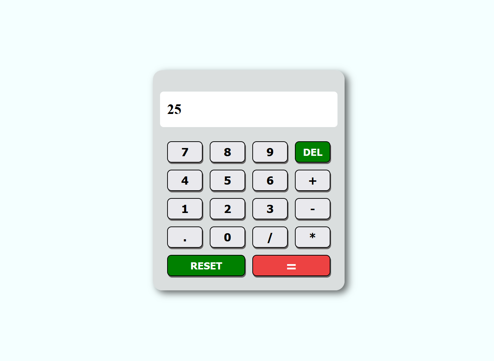

# Calculator App

A simple and interactive calculator built with **HTML**, **CSS**, and **JavaScript**.  
It performs the **four basic arithmetic operations** with a smooth and realistic user experience.

## Features

- Addition, subtraction, multiplication, and division
- Clean and easy-to-use interface
- Smooth button animations
- Realistic press effect when buttons are clicked

## Built With

- HTML
- CSS
- JavaScript

## About

This project was created to practice DOM manipulation, event handling, and CSS transitions.  
The buttons are designed to move inward when clicked, giving the feel of pressing real calculator buttons.

## Preview

